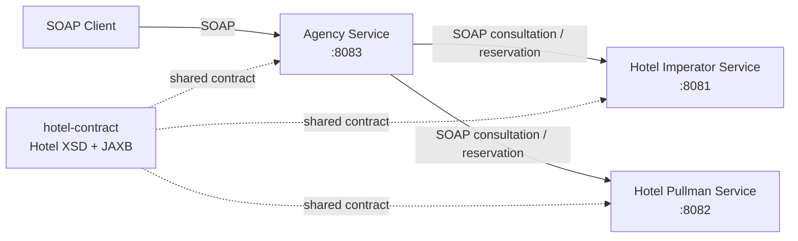

# Hotel Booking SOAP Spring-WS

[](https://github.com/theodev23/hotel-booking-soap-spring-ws/actions/workflows/ci.yml)

**Repository:** https://github.com/theodev23/hotel-booking-soap-spring-ws

A distributed hotel booking system built with **Java 21**, **Spring Boot 4** and
**Spring Web Services**.

The project demonstrates a contract-driven SOAP architecture in which an agency
service acts as an orchestrator between a client and two independent hotel
services.

It focuses on distributed service communication, XSD/JAXB contracts, business
validation, service orchestration, automated testing and reproducible builds.

## Overview

The system contains three executable Spring Boot applications:

- **Hotel Imperator Service** — exposes hotel availability and reservation
  operations on port `8081`.
- **Hotel Pullman Service** — exposes the same hotel contract on port `8082`.
- **Agency Service** — exposes an agency-facing SOAP API on port `8083` and
  orchestrates calls to both hotel services.

A shared `hotel-contract` Maven module contains the hotel XSD contract and its
generated JAXB classes.

The agency service owns a separate agency-facing XSD contract and translates
between the public agency API and the shared hotel API.

## Architecture



The agency service uses Spring's `WebServiceTemplate` to communicate
synchronously with the two hotel services.

For a consultation, it:

1. validates the search criteria;
2. queries Hotel Imperator;
3. queries Hotel Pullman;
4. aggregates the available offers;
5. applies the partner-agency pricing rule;
6. returns the resulting offers through its own SOAP contract.

For a reservation, the agency forwards the request to the hotel services and
returns the resulting reservation status to the client.

## Main Features

- Contract-driven SOAP APIs using XSD and JAXB.
- Shared hotel contract across multiple services.
- Multi-module Maven architecture.
- Service-to-service SOAP communication with `WebServiceTemplate`.
- Aggregation of offers from two independent hotel services.
- Agency authentication for hotel operations.
- Configurable demo credentials through environment variables.
- Partner-agency pricing using `BigDecimal`.
- Validation of dates, capacity and search criteria.
- Stateful in-memory reservation tracking.
- Reserved offers removed from subsequent availability results.
- SOAP endpoint tests with Spring Web Services Test.
- Automated CI with GitHub Actions.

## Technology Stack

| Area | Technology |
| --- | --- |
| Language | Java 21 |
| Framework | Spring Boot 4.0.1 |
| SOAP | Spring Web Services |
| Contract | XML Schema (XSD), WSDL |
| XML binding | JAXB |
| SOAP client | `WebServiceTemplate` |
| Build | Maven Wrapper |
| Unit testing | JUnit 5, Mockito |
| SOAP testing | Spring Web Services Test |
| CI | GitHub Actions |

## Maven Modules

```text
hotel-booking-soap-spring-ws/
├── .github/
│   └── workflows/
│       └── ci.yml
├── hotel-contract/
├── hotel-imperator-service/
├── hotel-pullman-service/
├── agency-service/
├── .gitignore
├── mvnw
├── mvnw.cmd
└── pom.xml
```

### `hotel-contract`

Contains the shared hotel XSD contract and generates the corresponding JAXB
classes during the Maven build.

Both hotel services implement this contract, while the agency service uses it
as the client-side model for downstream SOAP calls.

### `hotel-imperator-service`

Spring Boot SOAP service exposing:

- hotel consultation;
- hotel reservation.

Default port: `8081`.

### `hotel-pullman-service`

Second independent implementation of the same hotel SOAP contract.

Default port: `8082`.

### `agency-service`

Public-facing orchestration service.

It exposes its own SOAP contract and communicates with the two hotel services
through their shared hotel contract.

Default port: `8083`.

## SOAP Operations

### Hotel services

Namespace:

```text
http://hotel.com/soap
```

Operations are defined from the following request payloads:

- `ConsultationRequest`
- `ReservationRequest`

### Agency service

Namespace:

```text
http://agence.com/soap
```

Operations are defined from:

- `ConsultationAgenceRequest`
- `ReservationAgenceRequest`

A consultation response can legally contain **zero or more offers**, which is
explicitly represented in the agency XSD with `minOccurs="0"` and
`maxOccurs="unbounded"`.

## Demo Data

The application uses deterministic in-memory demo data.

| Hotel | Stars | Room | Beds | Base price / night |
| --- | ---: | --- | ---: | ---: |
| Hotel de l'imperator | 4 | `101` | 2 | `120.00` |
| Hotel Pullman | 3 | `201` | 3 | `90.00` |

Both rooms are configured as available from:

```text
2030-01-01
```

to:

```text
2030-12-31
```

The default partner agency receives a **10% discount**, producing the following
example prices:

| Offer | Partner price |
| --- | ---: |
| `Imperator-101` | `108.00` |
| `Pullman-201` | `81.00` |

Monetary values are represented with `BigDecimal`.

## Configuration

The applications can run immediately with demo defaults.

### Hotel services

Both hotel services support:

| Environment variable | Default |
| --- | --- |
| `DEMO_AGENCY_ID` | `AG001` |
| `DEMO_AGENCY_LOGIN` | `agence1` |
| `DEMO_AGENCY_PASSWORD` | `demo-password` |

These values are for local demonstration only.

They can be overridden before starting the applications:

```bash
export DEMO_AGENCY_ID="MY_AGENCY"
export DEMO_AGENCY_LOGIN="my-login"
export DEMO_AGENCY_PASSWORD="my-password"
```

The same `DEMO_AGENCY_ID` should be provided to the agency service so that its
partner-pricing rule remains aligned with the hotel configuration.

### Agency service

The downstream hotel service URLs are also configurable:

| Environment variable | Default |
| --- | --- |
| `HOTEL_IMPERATOR_URI` | `http://localhost:8081/ws` |
| `HOTEL_PULLMAN_URI` | `http://localhost:8082/ws` |
| `DEMO_AGENCY_ID` | `AG001` |

Example:

```bash
export HOTEL_IMPERATOR_URI="http://localhost:8081/ws"
export HOTEL_PULLMAN_URI="http://localhost:8082/ws"
```

## Build

### Requirements

- Java 21

A local Maven installation is not required because the repository includes the
Maven Wrapper.

Build all modules and run the full test suite:

```bash
./mvnw clean verify
```

Package the executable Spring Boot applications:

```bash
./mvnw clean package
```

## Run Locally

The three applications must run simultaneously.

First package the project:

```bash
./mvnw clean package
```

Then start each application in a separate terminal.

### Terminal 1 — Hotel Imperator

```bash
java -jar \
  hotel-imperator-service/target/hotel-imperator-service-1.0.0-SNAPSHOT.jar
```

### Terminal 2 — Hotel Pullman

```bash
java -jar \
  hotel-pullman-service/target/hotel-pullman-service-1.0.0-SNAPSHOT.jar
```

### Terminal 3 — Agency Service

```bash
java -jar \
  agency-service/target/agency-service-1.0.0-SNAPSHOT.jar
```

The default ports are:

| Service | Port |
| --- | ---: |
| Hotel Imperator | `8081` |
| Hotel Pullman | `8082` |
| Agency | `8083` |

## WSDL Endpoints

Once all services are running, their generated WSDL documents are available at:

```text
http://localhost:8081/ws/hotel.wsdl
http://localhost:8082/ws/hotel.wsdl
http://localhost:8083/ws/agence.wsdl
```

The SOAP endpoints themselves are:

```text
http://localhost:8081/ws
http://localhost:8082/ws
http://localhost:8083/ws
```

## Example Agency Consultation

Create a file named `consultation.xml`:

```xml
<soapenv:Envelope
    xmlns:soapenv="http://schemas.xmlsoap.org/soap/envelope/"
    xmlns:a="http://agence.com/soap">
    <soapenv:Header/>
    <soapenv:Body>
        <a:ConsultationAgenceRequest>
            <a:idAgence>AG001</a:idAgence>
            <a:login>agence1</a:login>
            <a:password>demo-password</a:password>
            <a:ville>Montpellier</a:ville>
            <a:dateArrivee>2030-06-01</a:dateArrivee>
            <a:dateDepart>2030-06-05</a:dateDepart>
            <a:nbPersonnes>2</a:nbPersonnes>
        </a:ConsultationAgenceRequest>
    </soapenv:Body>
</soapenv:Envelope>
```

Send it to the agency service:

```bash
curl \
  --fail \
  --silent \
  --show-error \
  -H 'Content-Type: text/xml; charset=utf-8' \
  --data-binary @consultation.xml \
  http://localhost:8083/ws
```

With the default demo data, this consultation returns two available offers:

```text
Imperator-101 -> 108.00
Pullman-201   -> 81.00
```

## Reservation Behaviour

Reservations are intentionally stateful within each running hotel service.

Once an offer is successfully reserved:

- its identifier is stored in an in-memory concurrent set;
- the same offer cannot be successfully reserved twice;
- the reserved offer disappears from subsequent consultations.

This state is not persisted. Restarting the hotel service resets the
reservations.

## Testing

The project currently contains **45 automated test methods**.

| Module | Tests |
| --- | ---: |
| Hotel Imperator Service | 16 |
| Hotel Pullman Service | 16 |
| Agency Service | 13 |
| **Total** | **45** |

The suite includes:

- Spring application-context tests;
- hotel business-logic tests;
- agency orchestration tests;
- validation and reservation-state tests;
- SOAP payload integration tests using `MockWebServiceClient`;
- an explicit test for a valid consultation response containing zero offers.

Run everything with:

```bash
./mvnw clean verify
```

## Continuous Integration

The repository contains a GitHub Actions workflow in:

```text
.github/workflows/ci.yml
```

For every push to `main` and every pull request, the workflow:

1. checks out the repository;
2. installs Temurin Java 21;
3. enables the Maven dependency cache;
4. executes:

```bash
./mvnw --batch-mode --no-transfer-progress clean verify
```

## Design Decisions

### XSD and JAXB contracts

SOAP payloads are defined through XML Schema rather than handwritten Java DTOs.

JAXB classes are generated during the Maven build, keeping the Java model
aligned with the SOAP contracts.

Generated sources are build artifacts and are therefore not committed to the
repository.

### Shared hotel contract

Both hotel implementations expose the same contract.

This allows the agency service to communicate with either hotel without
depending on implementation-specific request or response classes.

### `BigDecimal` for prices

Prices and pricing coefficients use `BigDecimal` rather than floating-point
types to avoid binary floating-point errors in monetary calculations.

### Externalized service configuration

Hotel URLs and demo agency configuration can be changed through environment
variables without modifying Java source code.

### Explicit empty consultation responses

A search can legitimately return no matching offer.

The agency XSD therefore models its offer collection as `0..n`, ensuring that
the SOAP contract accurately describes the application's behaviour.

## Limitations

This repository is a technical and educational demonstration rather than a
production booking platform.

Current limitations include:

- hotel and room data are stored in memory;
- reservation state is lost when a service restarts;
- there is no database;
- authentication uses configurable demo credentials rather than a production
  identity system;
- SOAP communication is synchronous;
- no production-grade retry, circuit-breaker or service-discovery mechanism is
  implemented;
- the reservation card field is demonstration data only and no real payment is
  processed;
- transport security and production deployment infrastructure are outside the
  scope of the project.

## Possible Extensions

Natural next steps would include:

- persistent storage with PostgreSQL;
- transactional reservation handling;
- Docker and Docker Compose deployment;
- stronger authentication and authorization;
- TLS configuration;
- resilience patterns for inter-service communication;
- structured observability and distributed tracing;
- additional hotel implementations;
- deployment to a cloud environment.

## What This Project Demonstrates

This project was designed to demonstrate practical understanding of:

- distributed software architecture;
- SOAP and Spring Web Services;
- service contracts and schema-driven development;
- XML, XSD, WSDL and JAXB;
- synchronous service orchestration;
- multi-module Maven projects;
- business validation and state management;
- automated unit and SOAP integration testing;
- configuration externalization;
- continuous integration with GitHub Actions.
